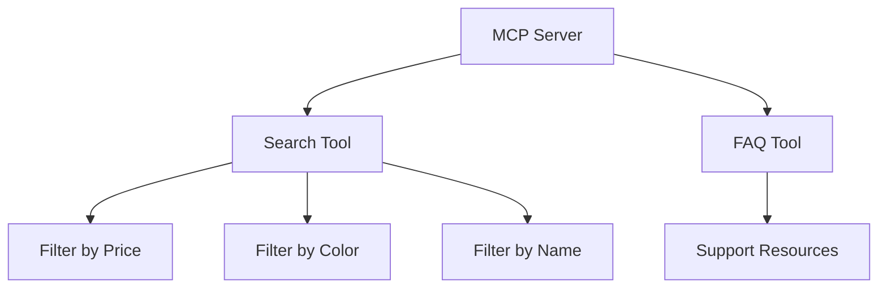

# Search and FAQ tools/resources

In this part, we will create a simple MCP server with a search tool meant for a hypothetical e-commerce website. 

## Server Features



## Setup

```sh
uv init # OR python -m venv .venv && .venv\Scripts\activate
```

## Install

```sh
uv add "mcp[cli]" # pip install "mcp[cli]"
```

Start the server

## Testing it out - VS Code

1. Start the server in the terminal.

    ```powershell
    mcp run server.py
    ```

1. Add the server to mcp.json

    Add it to *.vscode/mcp.json* like so:

    ```json
    {
    	"servers": {
    		"my-mcp-server-414ca0bf": {
    			"url": "http://127.0.0.1:8000/mcp",
    			"type": "http"
    		}
    	},
    	"inputs": []
    }
    ```

    1. Run prompts in VS Code + GitHub Copilot Chat
    
        Test the server with the following prompts in VS Code + GitHub Copilot.
    
    - show me navy sweater under 100, use a tool
    
        ```text
        Wool Sweater - $79.99 (navy)
        ```
    
    - show me items under 100, use a tool
    
        You should see the following output:
    
        ```text
        Cotton T-Shirt - $19.99 (red)
        Denim Jeans - $49.99 (blue)
        Wool Sweater - $79.99 (navy)
        Summer Dress - $39.99 (floral)
        Silk Blouse - $89.99 (white)
        Cargo Shorts - $29.99 (khaki)
        Athletic Hoodie - $59.99 (green)
    ```

- "Tell me about shipping in your FAQ"

   ```text
   Yes, we offer international shipping to select countries. Shipping fees and delivery times vary based on the destination."
   ```

## Next steps

This is all fine as long as we are using GitHub Copilot Chat to call the server. But if we want to build a real product, we're going to need to build our own client that can call the server, so let's look at that next.