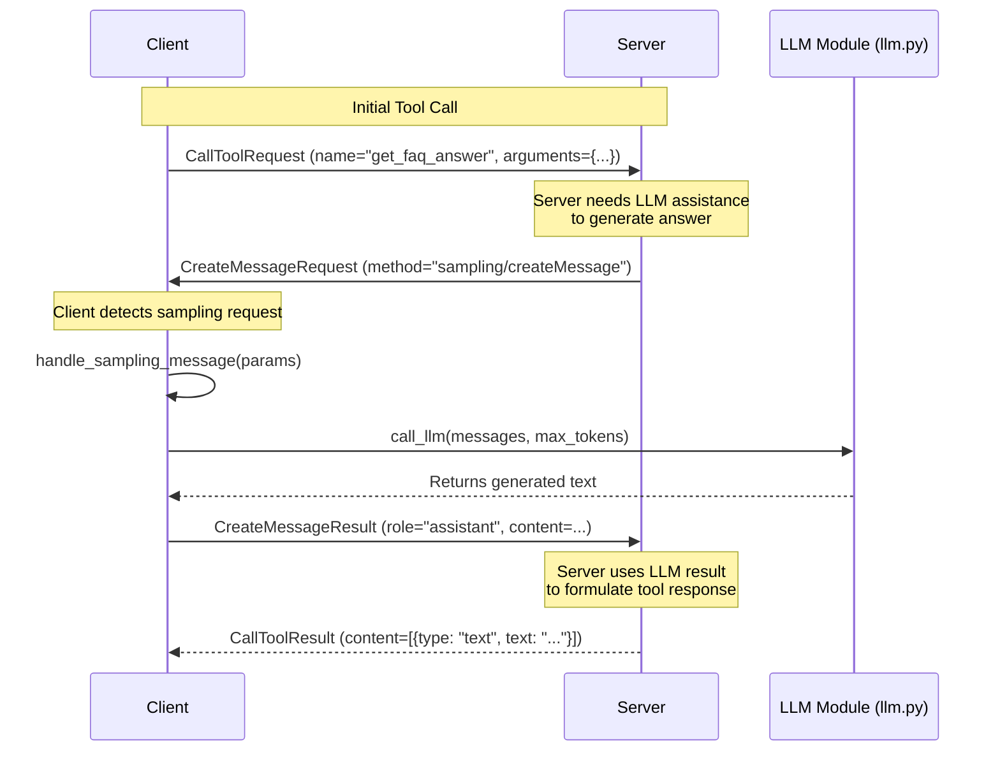

# Use an LLM client to call the MCP server    

So we have a server with some tools, search and FAQ. 

> You're not going to be able to ship GitHub Copilot Chat, so you need to learn how to build your own agentic client that can call your MCP server.

- Now let's build a client that can call those tools. And, let's make it smart by using an LLM to decide when to call the tools and how to use them.
- Also, let's add sampling to FAQ so that we can get more relevant results.

## Architecture overview



## Install

```bash
uv add "mcp[cli]" github-copilot-sdk
```

## Test the server with VS Code

1. Start the server from mcp.json. (Take the lesson 1 server down first and ensure you start this one with mcp run server.py)
1. Type the following in the chat "#get_faq_answer tell me about shipping options"
1. Type the following in the chat "#get_faq_answer do you ship to Sweden?"

## Build a client

The client uses sampling, which means it calls a tool on the server, handles a sampling message, calls its LLM (GitHub Copilot SDK) to generate a response.

1. In a separate terminal window, run the client with `uv run client.py`

   ```bash
    uv run client.py
    ```

    You should see a response similar to this:

    ```text
    Starting client...
    [LOG] Session initialized, ready to call tools.
    [LOG] Calling tool with query: Do you ship to Sweden?
    [Client response] Tool result: 
    Yes, we offer international shipping to select countries. Please check our website or contact customer support to confirm if Sweden is included.
    ``` 

## Exercise - improve the LLM with system instructions

We need to give the LLM better instructions, right now it's just generating text with no guidance.

Here's how you can set system instructions when creating a session with the GitHub Copilot SDK:

```python
session = await client.create_session({
        "model": "gpt-4.1",
        "system_message": {
            "mode": "replace",
            "content": "You are Captain Picard"
        }
    })
```

Try changing it to that of a helpful customer support agent, see `llm.py` for performing changes.

[Solution](./solution/app.py)
