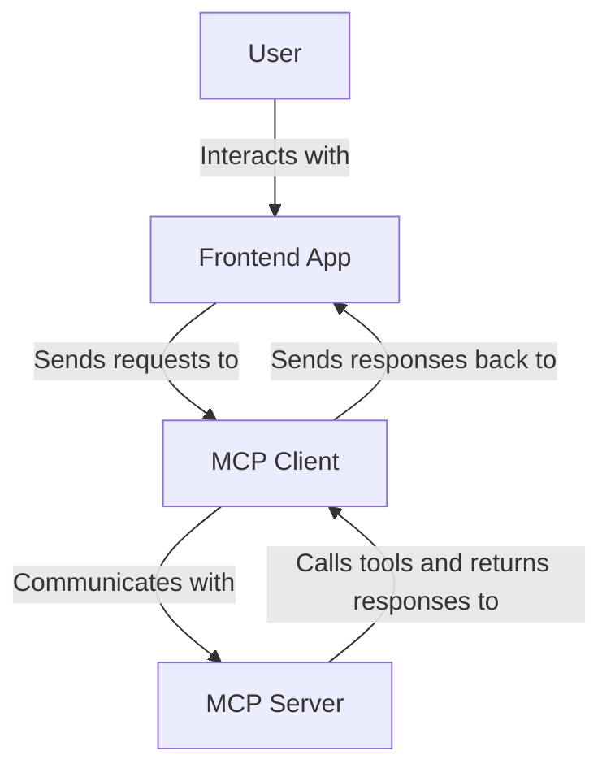

# Adding a frontend

There are a few different ways to handle this depending on your needs, here's two different scenarios:

1. Integrate MCP into an existing app. Here you want an MCP Server that you talk to via an MCP Client.
1. Consume an MCP Server. Here you can use an Agent like Claude or GitHub Copilot. 

We'll focus on the first scenario in this section, but the second is also very common and we'll cover it in the next section.

Here's what the architecture looks like with a frontend:



## Install 

```bash
uv sync
```

OR if you use pip:

```bash
pip install fastapi uvicorn mcp[cli] github-copilot-sdk
```